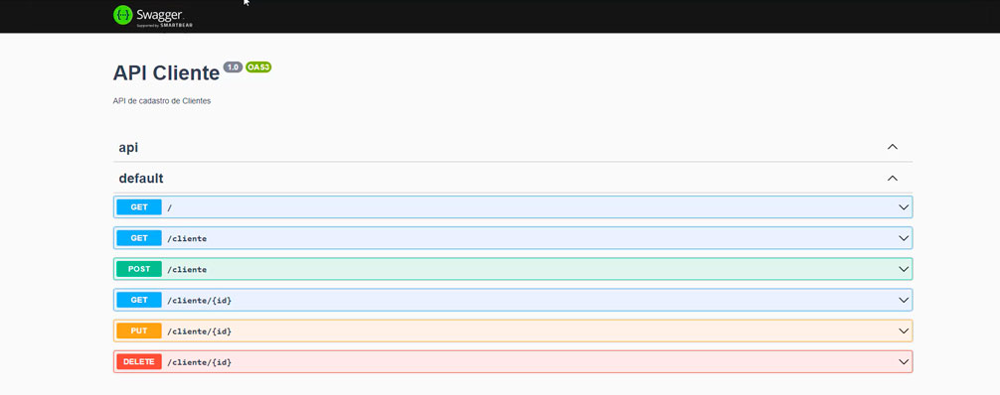
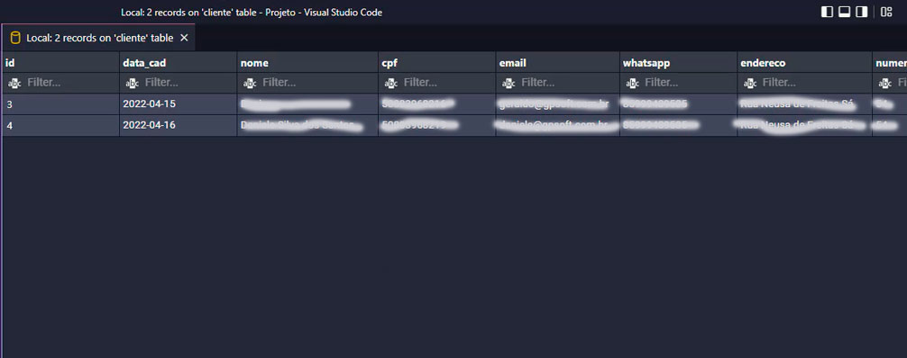
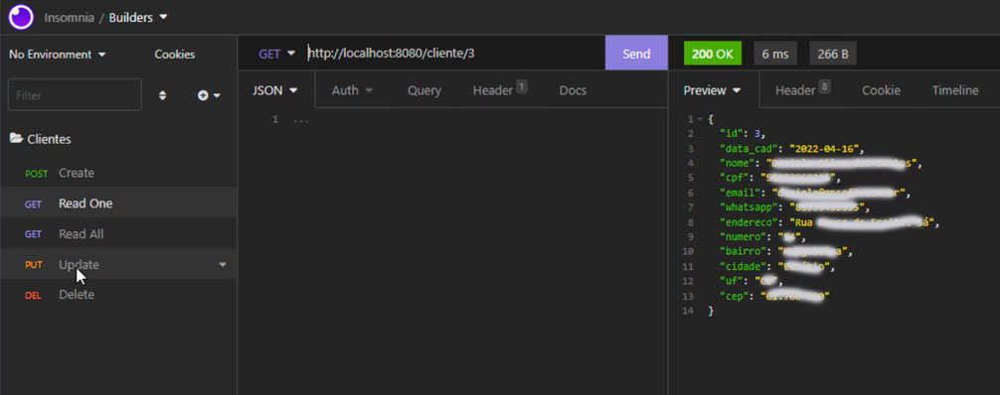

<p align="center">
  <a href="http://nestjs.com/" target="blank"></a>
</p>

[travis-image]: https://api.travis-ci.org/nestjs/nest.svg?branch=master
[travis-url]: https://travis-ci.org/nestjs/nest
[linux-image]: https://img.shields.io/travis/nestjs/nest/master.svg?label=linux
[linux-url]: https://travis-ci.org/nestjs/nest
  
<p align="center">Projeto de um BackEnd usando o NestJs para uma base de Clientes em Mysql</p>
<p align="center">

## Technologias usadas neste projeto
 
  
## Objetivo
BackEnd usando NestJs com banco Mysql, disponível o swagger na raiz do projeto e o Json pra uso no Insomnia ou Postman.

## Instale o Pacote 
Caso tenha o Xampp instalado crie apenas o banco de nome: builders e execute os comandos abaixo:

```bash
$ npm install
```
  
## Rodar o app
```bash
$ npm run start
$ npm run start:dev
$ npm run start:prod
```
  
## Caso tenha o Docker para montar a imagem use:
```bash
$ docker-compose up dev database_clientes
```

## Para acesso à URL
http://localhost:8080/ ou http://localhost:3333/ se usar Docker
  
## Para acesso à URL Swagger
http://localhost:8080/api
  
## Swagger
swagger.json << Arquivo encontra-se na Raiz
 
  
## Banco de Dados
builders.sql << Arquivo encontra-se na Raiz
 
  
## Arquivo JSON parar usar no Insomnia ou Postman
Insomnia_2022-04-16.json << Arquivo encontra-se na Raiz
 

## Video Demo
<a href="https://youtu.be/HUl-Nuvemcw" target="_blank">Clique Aqui</a>

## Testes
```bash
$ npm run test
$ npm run test:e2e
$ npm run test:cov
```

## Support

geraldo@gpsoft.com.br

## Stay in touch

- Author - [Geraldo P Melo](https://gpsoft.com.br)

